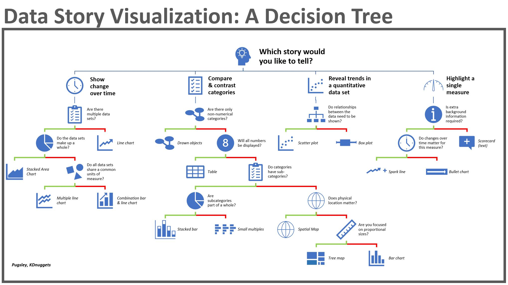
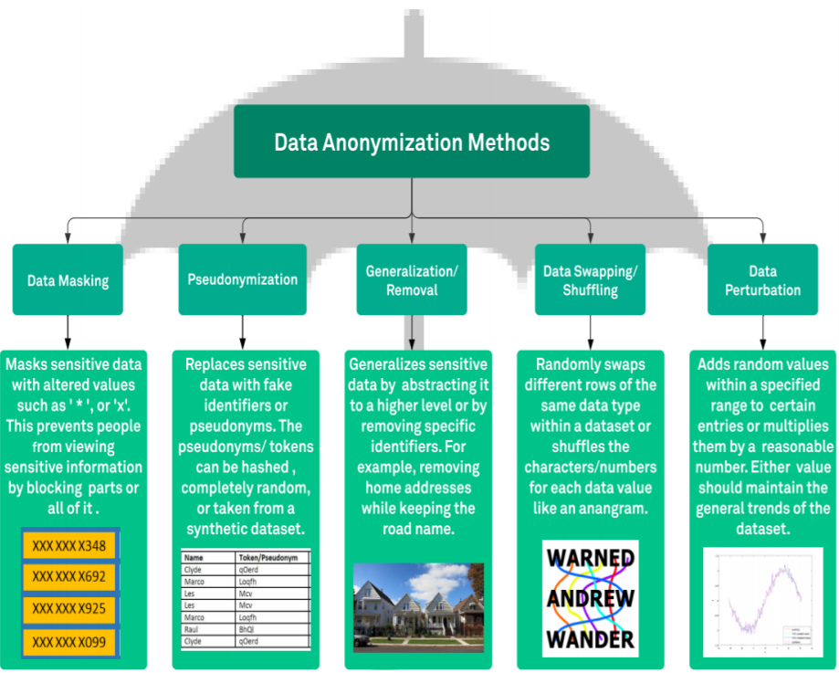

# Data Tips & Tricks

Some Tips and Tricks about Data.

     

## Useful documents

* ETL project plan
* Data Integration Master Test Plan

## Useful links

* [DBLog](https://netflixtechblog.com/dblog-a-generic-change-data-capture-framework-69351fb9099b) - A Generic Change-Data-Capture Framework
* [Delta](https://netflixtechblog.com/delta-a-data-synchronization-and-enrichment-platform-e82c36a79aee) - A Data Synchronization and Enrichment Platform
* [Master Test Plan](https://dzone.com/articles/part-3-how-to-develop-a-data-integration-master-te)
* [ETL DWH Testing](https://www.guru99.com/utlimate-guide-etl-datawarehouse-testing.html#:~:text=Data%20Warehouse%20Testing%20is%20a%20testing%20method%20in,order%20to%20comply%20with%20the%20company%27s%20data%20framework)
* [DWH tutorial](https://www.tutorialspoint.com/dwh/index.htm)
* [The Data Engineering Cookbook](https://github.com/andkret/Cookbook)
* [Azimutt](https://azimutt.app/) - Explore your database schema

## Useful resources

## Tomorrow I will learn

* [Apache Nifi](https://dzone.com/articles/apache-nifi-overview?fromrel=true)
* [FastAPI](https://fastapi.tiangolo.com/)
* [Apache Superset](https://superset.apache.org/docs/intro) - Business intelligence web application
* [dbt](https://www.getdbt.com/) - Data Build Tool
* [Apache Cayenne](https://cayenne.apache.org/)
* [DbFit](http://dbfit.github.io/dbfit/) - Test-driven database development
* [Visadata](https://www.visidata.org/) - Interactive multitool for tabular data
* [Datasette](https://datasette.io/) - Open source multi-tool for exploring and publishing data
* [The State of Data Engineering in 2021](https://lakefs.io/the-state-of-data-engineering-in-2021/?utm_content=bufferea4cb&utm_medium=social&utm_source=linkedin.com&utm_campaign=buffer)
* [DocParser](https://docparser.com/)
* [Scraper API](https://www.scraperapi.com/) - Proxy API for Web Scraping
* [Import.io](https://www.import.io/) - Web data integration
* [Altair Monarch](https://www.altair.com/)

## Build with

* [Git](https://git-scm.com) - Open source distributed version control system

## Contributing

If you would like to contribute, read the CONTRIBUTING.md file to learn how to do so.
