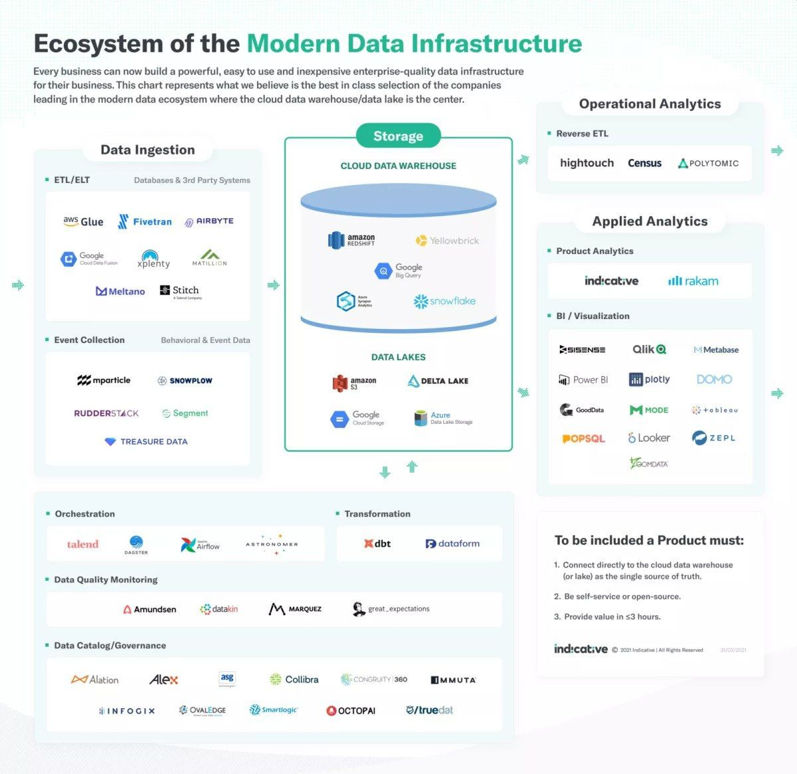
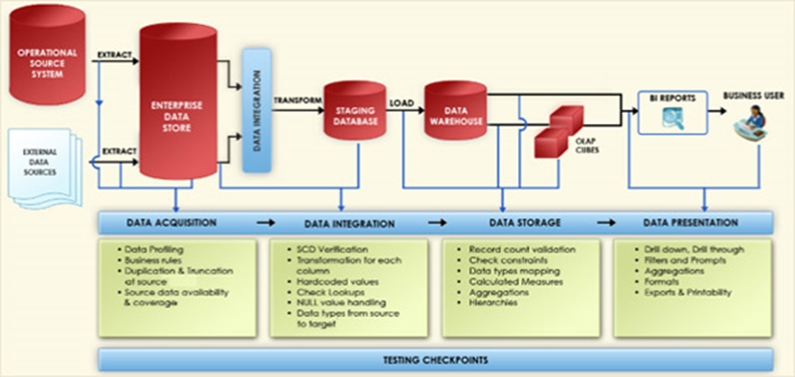

# Data Tips & Tricks

Some Tips and Tricks about Data.

     

## Useful documents

* ETL project plan
* Data Integration Master Test Plan

## Useful links

* [DBLog](https://netflixtechblog.com/dblog-a-generic-change-data-capture-framework-69351fb9099b) - A Generic Change-Data-Capture Framework
* [Delta](https://netflixtechblog.com/delta-a-data-synchronization-and-enrichment-platform-e82c36a79aee) - A Data Synchronization and Enrichment Platform
* [Master Test Plan](https://dzone.com/articles/part-3-how-to-develop-a-data-integration-master-te)

## Useful resources

## Tomorrow I will learn

* [Apache Nifi](https://dzone.com/articles/apache-nifi-overview?fromrel=true)
* [FastAPI](https://fastapi.tiangolo.com/)
* [Apache Superset](https://superset.apache.org/docs/intro) - Business intelligence web application
* [dbt](https://www.getdbt.com/) - Data Build Tool
* ORM [Apache Cayenne](https://cayenne.apache.org/)
* [DbFit](http://dbfit.github.io/dbfit/) - Test-driven database development

## Build with

* [Git](https://git-scm.com) - Open source distributed version control system

## Contributing

If you would like to contribute, read the CONTRIBUTING.md file to learn how to do so.
